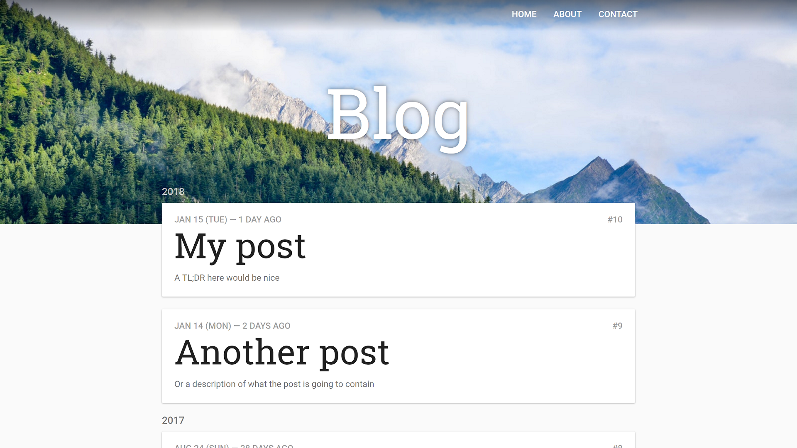
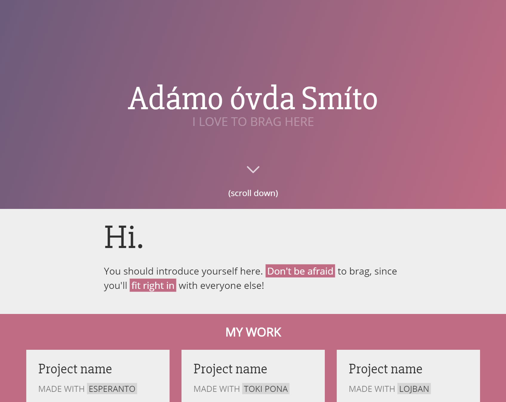

# `themes`
Website themes that I made. They're free, and you can steal them.

## [Billy Goat](https://sheeptester.github.io/themes/billy-goat/)

[main page](https://sheeptester.github.io/themes/billy-goat/) • [post page](https://sheeptester.github.io/themes/billy-goat/post.html) • [main page (dark theme)](https://sheeptester.github.io/themes/billy-goat/index-dark.html) • [post page (dark theme)](https://sheeptester.github.io/themes/billy-goat/post-dark.html)

Tags: `materialesque light dark blog unnecessary-images`

**Claimed by: [Mountio](https://mountio.github.io/)**

Credits: [Google Fonts](https://fonts.google.com/), [Simple Icons](https://simpleicons.org/), [Material Design Guidelines](https://material.io/guidelines/), [Unsplash](https://unsplash.com/)

## [F9 Key](https://sheeptester.github.io/themes/f9-key/)

[the only page](https://sheeptester.github.io/themes/f9-key/)

Tags: `flat gradient animated-scroll-down single-page huge-intro`

**Unclaimed**

Credits: [Google Fonts](https://fonts.google.com/), [Simple Icons](https://simpleicons.org/), [Color Hunt](http://colorhunt.co/c/100885), [Email Address Regular Expression That 99.99% Works](http://emailregex.com/)
